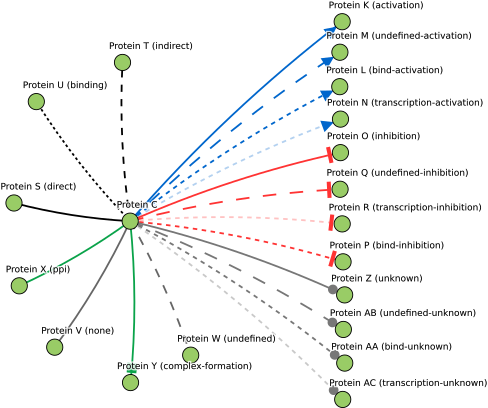

# SPV - Signaling Pathway Visualizer v1.0

## Overview
This is a Javascript library build on top of D3.js to visualize molecular interactions with particular attention to signaling pathways.

## Installation
1) Copy the js directory in your where you want within your website
2) Add the following line in the webpage you want to add the visualizer in:
```html
<script>
  baseurl = ".";
</script>
<script src="./js/SPV_v1.0.js"></script>
```
3) Set the variable baseurl to the url where you copied the js directory. This is to find tool bar images, you can change it.
4) Add a <div></div> block to host the graphical representation of your network
```html
<center>
  <div id="graphArea" style="width:640px;height:480px;background:white;overflow:hidden;"></div>
</center>
```
5) Define a json object listing the links of your network:
```javascript
var links = [
  {source: "Protein A", idA: "A", typeA: "protein", target: "Protein B", idB: "B", typeB: "protein", type: "none", score: 0.1},
  {source: "Protein A", idA: "A", typeA: "protein", target: "Protein C", idB: "C", typeB: "protein", type: "none", score: 0.4}
];    
```
6) If you want define a list of texts to visualize when the user clicks on nodes and edges. Edge list keys must have has key the concatenation of the two ids of the source and target node:
```javascript
var node_labels = [];
node_labels["A"] = "This is a description for <b>Protein A</b>";
node_labels["B"] = "This is a description for <b>Protein B</b>";

var edge_labels = [];
edge_labels["AB"] = "This links <b>Protein A<b> and <i>Protein B</i>";
```
7) (Optional) Push ids of the elements you want to be placed on fixed layers:
```javascript
var extracellular = [];
var factors = [];
var receptors = [];
var phenotypesList = [];
```
8) Initialize the graph:
```javascript
initGraph(links, node_labels, edge_labels, "graphArea", 640, 480, "A", 1, 0);
```

## Library details

### Already Defined Edges

We defined the following markers:
1) A standard arrow for activations
2) A T shaped arrow for inhibitions
3) A circle for unknown effects
4) A square for complex formation

1, 2 and 3 can be mixed with line types, for example transcriptional-activation, transcriptional-inhibition

The following image shows aldready defined edges



### Already Defined Objects

List of possible values for the type attribute


### initGraph(links, node_labels, edge_labels, htmlPageDiv, width, height, seedNodesList, signalingOrPPI, hideToolBar);
- *links*: a json object containing the graph edges, and thus nodes.
- *node_labels, edge_labels list*: arrays containing tool-tips to visualize on mouse click on edges and nodes. If empty *null* dynamical pages will be queried: *getUniprotDescription.php* and *getEvidence.php*.
- *htmlPageDiv*: is the id of the div to use to visualize the graph.
- *width* and *height* define the size of the graph.
- *seedNodesList*: a list of nodes to color in dark green representing the pathway seed proteins.
- *signalingOrPPI*: signaling=1 or PPI=0. Signaling shown the cell and basic comparments. PPI let the graph float free in space.
- *hideToolBar*: hides=1, or visualize=0 the top menu bar.

### setNodesColor(htmlPageDiv, idsList, color);
It can be used to highlight specific nodes after the visualization has been initialized. It can be used to highlight or animate the graph.

### Extras
The file *constants.js* already contains a list of Uniprot ID with their compartments. It also contains a list of complexes. This file can be edited as you wish.
